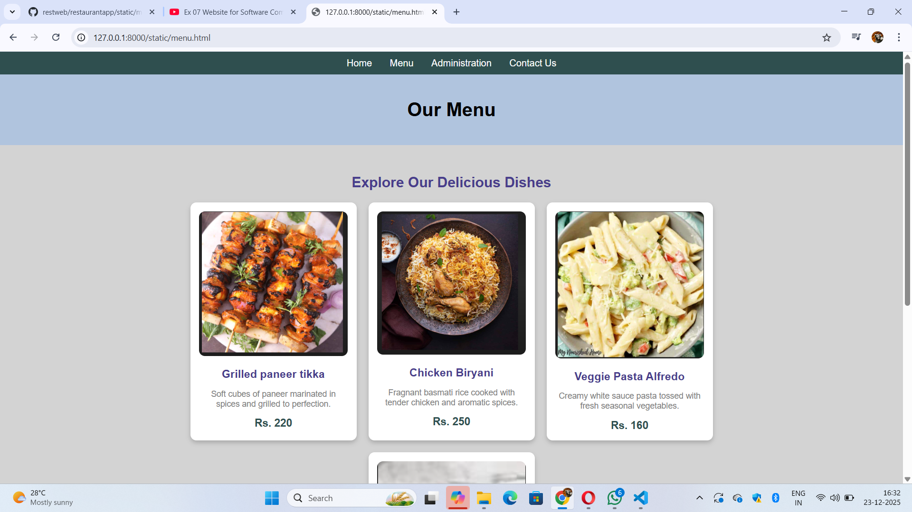

6# Ex.07 Restaurant Website
## Date:13/12/25
### Ref:25018612

## AIM:
To develop a static Restaurant website to display the food items and services provided by them.

## DESIGN STEPS:

### Step 1:
Requirement collection.

### Step 2:
Creating the layout using HTML and CSS.

### Step 3:
Updating the sample content.

### Step 4:
Choose the appropriate style and color scheme.

### Step 5:
Validate the layout in various browsers.

### Step 6:
Validate the HTML code.

### Step 7:
Publish the website in the given URL.

## PROGRAM:
```
<html>
<head>
    <title>Book a Table - STEP IN</title>
    <style>
        body {
            font-family: Arial, sans-serif;
            margin: 0;
            padding: 0;
            background-color: lightgray;
        }
        nav {
            background-color: darkslategray;
            color: white;
            display: flex;
            justify-content: center;
            padding: 10px 0;
        }
        nav a {
            text-decoration: none;
            color: white;
            margin: 0 15px;
        }
        header {
            text-align: center;
            background-color: lightsteelblue;
            padding: 20px;
        }
        .booking-section {
            padding: 30px;
            max-width: 600px;
            margin: auto;
            background-color: white;
            border-radius: 10px;
            box-shadow: 0 4px 8px rgba(0, 0, 0, 0.2);
        }
        .booking-section h2 {
            text-align: center;
            color: darkslateblue;
            margin-bottom: 20px;
        }
        .booking-form {
            display: flex;
            flex-direction: column;
            gap: 15px;
        }
        .booking-form input, .booking-form select, .booking-form button {
            padding: 10px;
            font-size: 16px;
            border: 1px solid gray;
            border-radius: 5px;
        }
        .booking-form button {
            background-color: darkslateblue;
            color: white;
            cursor: pointer;
        }
        .booking-form button:hover {
            background-color: slateblue;
        }
    </style>
</head>
<body>

<nav>
    <a href="index.html">Home</a>
    <a href="menu.html">Menu</a>
    <a href="adminstration.html">Administration</a>
    <a href="contact.html">Contact Us</a>
</nav>

<header>
    <h1>Book a Table</h1>
</header>

<div class="booking-section">
    <h2>Reserve Your Table Now</h2>
    <form class="booking-form">
        <input type="text" name="name" placeholder="Your Full Name" required>
        <input type="email" name="email" placeholder="Your Email" required>
        <input type="tel" name="phone" placeholder="Your Phone Number" required>
        <select name="guests" required>
            <option value="" disabled selected>Number of Guests</option>
            <option value="1">1 Guest</option>
            <option value="2">2 Guests</option>
            <option value="3">3 Guests</option>
            <option value="4">4 Guests</option>
            <option value="5">5 Guests</option>
            <option value="6+">6+ Guests</option>
        </select>
        <input type="date" name="date" required>
        <input type="time" name="time" required>
        <button type="submit">Book Now</button>
    </form>
</div>

</body>
</html>

<html>
<head>=
    <title>STEP IN</title>
    <style>
        body {
            font-family: Arial, sans-serif;
            margin: 0;
            padding: 0;
            background-color: white;
        }
        header {
            background-color: wheat;
            text-align: center;
            padding: 20px;
        }
        header img {
            width: 50px;
        }
        nav {
            background-color: grey;
            color: white;
            display: flex;
            justify-content: center;
            padding: 10px 0;
        }
        nav a {
            text-decoration: none;
            color: white;
            margin: 0 15px;
        }
        .banner {
            text-align: right;
            background-image: url('restaurant.png');
            background-size: cover;
            background-position: center;
            color: white;
            padding: 50px;
        }
        .banner h2 {
            margin: 0;
        }
        .banner p {
            margin-top: 10px;
        }
        .sections {
            display: flex;
            justify-content: space-around;
            padding: 20px;
            gap: 10px;
        }
        .section {
            background-color: wheat;
            padding: 15px;
            border-radius: 10px;
            text-align: center;
            width: 30%;
        }
        .section img {
            width: 100%;
            border-radius: 10px;
        }
        footer {
            text-align: center;
            background-color: white;
            padding: 10px;
            margin-top: 20px;
        }
        footer a {
            text-decoration: none;
            color: blanchedalmond;
        }
    </style>
</head>
<body>

<header>
     
    <h1>STEP IN</h1>
</header>

<nav>
    <a href="index.html">Home</a>
    <a href="menu.html">Menu</a>
    <a href="adminstration.html">Administration</a>
    <a href="contact.html">Contact Us</a>
</nav>

<div class="banner">
    <h2>40% Off This Weekend</h2>
    <p>Don't miss out on our special offer! Visit us this weekend and enjoy delicious meals at discounted prices.</p>
</div>

<div class="sections">
    <div class="section">
         
        <h3>Our New Menu</h3>
        <p>Explore a variety of mouthwatering dishes crafted to satisfy every taste. From savory appetizers to hearty main courses, there's something for everyone.</p>
        <a href="menu.html">See our new menu</a>
    </div>
    <div class="section">
         
        <h3>Reserve Your Spot</h3>
        <p>Enjoy an unforgettable dining experience at STEP IN. Book your table today and treat yourself to a fantastic meal in a cozy ambiance.</p>
        <a href="booktable.html">Book your table now</a>
    </div>
    <div class="section">
         
        <h3>Opening Hours</h3>
        <p>
            Mon - Fri: 2pm - 10pm<br>
            Sat: 2pm - 11pm<br>
            Sun: 2pm - 9pm
        </p>
    </div>
</div>

<footer>
    <p>Designed and Developed by Ramen Kishore .N <br> 25018612/p>
</footer>

</body>
</html>

<html>
<head>
    <style>
        body {
            font-family: Arial, sans-serif;
            margin: 0;
            padding: 0;
            background-color: lightgray;
        }
        nav {
            background-color: darkslategray;
            color: white;
            display: flex;
            justify-content: center;
            padding: 10px 0;
        }
        nav a {
            text-decoration: none;
            color: white;
            margin: 0 15px;
        }
        header {
            text-align: center;
            background-color: lightsteelblue;
            padding: 20px;
        }
        .menu-section {
            padding: 30px;
            max-width: 1000px;
            margin: auto;
        }
        .menu-title {
            text-align: center;
            color: darkslateblue;
            margin-bottom: 20px;
        }
        .menu-items {
            display: flex;
            flex-wrap: wrap;
            gap: 20px;
            justify-content: center;
        }
        .menu-item {
            background-color: white;
            border-radius: 10px;
            box-shadow: 0 4px 8px rgba(0, 0, 0, 0.2);
            text-align: center;
            padding: 15px;
            width: 250px;
        }
        .menu-item img {
            width: 100%;
            border-radius: 10px;
            margin-bottom: 10px;
        }
        .menu-item h3 {
            color: darkslateblue;
            margin: 10px 0;
        }
        .menu-item p {
            color: gray;
            font-size: 14px;
        }
        .menu-item span {
            display: block;
            font-size: 18px;
            font-weight: bold;
            color: darkslategray;
            margin-top: 10px;
        }
    </style>
</head>
<body>

<nav>
    <a href="index.html">Home</a>
    <a href="menu.html">Menu</a>
    <a href="adminstration.html">Administration</a>
    <a href="contact.html">Contact Us</a>
</nav>

<header>
    <h1>Our Menu</h1>
</header>

<div class="menu-section">
    <h2 class="menu-title">Explore Our Delicious Dishes</h2>
    <div class="menu-items">
        <div class="menu-item">
            
            <h3>Grilled paneer tikka</h3>
            <p>Soft cubes of paneer marinated in spices and grilled to perfection.</p>
            <span>Rs. 220</span>
        </div>
        <div class="menu-item">
            
            <h3>Chicken Biryani</h3>
            <p>Fragnant basmati rice cooked with tender chicken and aromatic spices.</p>
            <span>Rs. 250</span>
        </div>
        <div class="menu-item">
            
            <h3>Veggie Pasta Alfredo</h3>
            <p>Creamy white sauce pasta tossed with fresh seasonal vegetables.</p>
            <span>Rs. 160</span>
        </div>
        <div class="menu-item">
            
            <h3>Chocolate Lava Cake</h3>
            <p>Warm Chocolate Cake with a gooey molten centre.</p>
            <span>Rs. 150</span>
        </div>
    </div>
</div>

</body>
</html>

```
## OUTPUT:


## RESULT:
The program for designing software company website using HTML and CSS is completed successfully.
